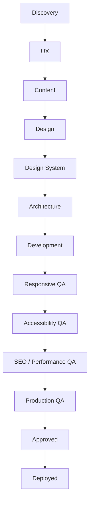

# Agentic Website Factory

## AI-Powered Website Design, Development & QA System


**Version:** 1.0.0

**Status:** Foundation

**Agents:** 11

**Templates:** 3

The **Agentic Website Factory** is a reusable AI-assisted workflow for transforming a business idea, client brief, existing website, or approved design into a structured, production-ready website.

## Table of Contents

- [Core Principle](#1-core-principle)
- [Agent Pipeline](#2-agent-pipeline)
- [Directory Structure](#3-directory-structure)
- [Templates](#4-templates)
- [Client Projects](#6-client-projects)
- [Design-to-Code Principle](#7-design-to-code-principle)
- [AI Agent Compatibility](#9-ai-agent-compatibility)
- [Future Extensions](#22-future-extensions)

The system divides website creation into specialized AI agents.

Each agent has:

- A defined responsibility
- Defined inputs
- A defined process
- Structured outputs
- Quality rules
- Handoff instructions
- Approval requirements

The objective is to make website production:

- Repeatable
- Structured
- Scalable
- AI-friendly
- Developer-friendly
- Design-system driven
- Quality controlled

---

# 1. CORE PRINCIPLE

The Agentic Website Factory follows a sequential workflow:

```text
Business Discovery
        ↓
UX / Information Architecture
        ↓
Content Strategy
        ↓
UI / UX Design
        ↓
Design System
        ↓
Frontend Architecture
        ↓
Development
        ↓
Responsive QA
        ↓
Accessibility QA
        ↓
SEO / Performance QA
        ↓
Production QA
        ↓
Human Approval
        ↓
Production
```

# 2. AGENT PIPELINE

| Agent | Responsibility | Output |
| --- | --- | --- |
| 01 | Business Discovery | `business-brief.md` |
| 02 | UX / Information Architecture | `sitemap.md` |
| 03 | Content Strategy | `content-strategy.md` |
| 04 | UI / UX Design | `ui-ux-specification.md` |
| 05 | Design System | `design-system.md` |
| 06 | Frontend Architecture | `technical-architecture.md` |
| 07 | Development | Working website |
| 08 | Responsive QA | `responsive-qa-report.md` |
| 09 | Accessibility QA | `accessibility-qa-report.md` |
| 10 | SEO / Performance | `seo-performance-report.md` |
| 11 | Production QA | `production-qa-report.md` |

# 3. DIRECTORY STRUCTURE
```text
Agentic-Website-Factory/
│
├── agents/
│   ├── 01_Business_Discovery_Agent.md
│   ├── 02_UX_Information_Architecture_Agent.md
│   ├── 03_Content_Strategy_Agent.md
│   ├── 04_UI_UX_Design_Agent.md
│   ├── 05_Design_System_Agent.md
│   ├── 06_Frontend_Architect_Agent.md
│   ├── 07_Development_Agent.md
│   ├── 08_Responsive_QA_Agent.md
│   ├── 09_Accessibility_QA_Agent.md
│   ├── 10_SEO_Performance_Agent.md
│   └── 11_Production_QA_Agent.md
│
├── templates/
│   ├── business-brief-template.md
│   ├── sitemap-template.md
│   └── technical-architecture-template.md
│
└── README.md
```
# 4. TEMPLATES
## Available Templates

| Template | Purpose |
| --- | --- |
| `business-brief-template.md` | Business objectives, audience, services, and requirements |
| `sitemap-template.md` | Navigation, routes, and page hierarchy |
| `technical-architecture-template.md` | Stack, routing, components, and deployment |


# 5. INPUT → PROCESS → OUTPUT

```text
INPUT
   ↓
PROCESS
   ↓
OUTPUT
   ↓
NEXT AGENT

Business Information
Client Requirements
Brand Assets
Existing Website
Competitor References
Design References
Stitch / Figma Design
Content
Technical Requirements
        ↓
      AGENTS
        ↓
Structured Outputs
        ↓
    DEVELOPMENT
        ↓
         QA
        ↓
    PRODUCTION
```

Each agent must clearly define:

| Stage | Description |
| --- | --- |
| **INPUT** | Information received by the agent |
| **PROCESS** | Analysis and decision-making |
| **OUTPUT** | Deliverables produced |
| **HANDOFF** | Files passed to the next agent |

# 6. CLIENT PROJECTS

## Factory Repository

```text
Agentic-Website-Factory/
```

## Example Client Project

```text
ClientName-website/
│
├── INPUT/
│   ├── business-information/
│   ├── brand-assets/
│   ├── existing-website/
│   ├── competitor-references/
│   ├── Stitch-Figma/
│   └── client-requirements/
│
├── 01-business-discovery/
├── 02-ux/
├── 03-content/
├── 04-design/
├── 05-design-system/
├── 06-architecture/
├── 07-development/
├── 08-responsive-qa/
├── 09-accessibility-qa/
├── 10-seo-performance/
└── 11-production-qa/
```
# 7. DESIGN-TO-CODE PRINCIPLE

The visual design is treated as a structured source of truth.

Design information should not exist only as screenshots.

Where possible, the design pipeline should provide:

- Layout specifications
- Component specifications
- Design tokens
- Typography
- Colors
- Spacing
- Breakpoints
- Responsive behavior
- Interaction states
- Assets
- Motion specifications

The goal is to make the design understandable to:

- Human designers
- Developers
- Claude Agent
- Gemini
- Google AI Studio
- Cursor
- Other AI coding agents

The development agent must follow the approved design specification.

It must not redesign or simplify the approved design without authorization.

# 8. STITCH / FIGMA INTEGRATION
```text
Design
│
├── Screens
├── Components
├── Design Tokens
├── Typography
├── Colors
├── Spacing
├── Breakpoints
├── Assets
├── Responsive Rules
├── Interaction States
└── Motion Specifications
Stitch-Figma/
│
├── Screens/
├── Components/
├── Assets/
├── Design-Tokens/
├── Typography/
├── Responsive/
└── Documentation/
```
# 9. AI AGENT COMPATIBILITY

The Agentic Website Factory is designed to work with modern AI development environments.

Supported workflows may include:

- Claude Agent
- Gemini
- Google AI Studio
- Cursor
- VS Code AI agents
- Other AI coding agents

Agents should consume structured Markdown and JSON outputs whenever possible.

Markdown provides human-readable documentation.

JSON provides machine-readable information.

The objective is to make project information portable between different AI tools.

# 10. STRUCTURED OUTPUTS
```text
design-system.md
design-system.tokens.json

{
  "colors": {},
  "typography": {},
  "spacing": {},
  "breakpoints": {},
  "components": {}
}

```
# 11. HANDOFF PRINCIPLE
```text
Agent 01
Business Discovery
        ↓
business-brief.md
        ↓
Agent 02
UX / Information Architecture
        ↓
sitemap.md
```
# 12. QUALITY GATES
```text
Agent 01
   ↓
Business Approved?
   ↓ YES
Agent 02
   ↓
UX Approved?
   ↓ YES
Agent 03
   ↓
Content Approved?
   ↓ YES
Agent 04
```
# 13. QA FEEDBACK LOOP
```text
Development
     ↓
Responsive QA
     ↓
Issue Found
     ↓
Development Agent
     ↓
Fix
     ↓
Responsive QA
     ↓
PASS
```

# 14. DEFECT SEVERITY

Defects are classified using the following levels.

## 🔴 P0 — BLOCKER

Prevents release.

**Examples:**

- Application does not build
- Application does not start
- Critical production route is unavailable
- Critical security exposure

## 🟠 P1 — CRITICAL

A major user journey or business function is broken.

**Examples:**

- Contact form completely broken
- Main navigation unusable
- Primary conversion flow unavailable

## 🟡 P2 — MAJOR

A significant issue that should normally be fixed before release.

**Examples:**

- Important visual defect
- Major responsive issue
- Important non-critical integration failure

## 🔵 P3 — MINOR

A low-impact issue that does not prevent normal use.

## ⚪ P4 — COSMETIC

A very low-impact visual or polish issue.

# 15. RELEASE GATE

The website should only receive:

## ✅ READY FOR PRODUCTION

when all critical quality gates have passed.

The following normally prevent production release:

- P0 issues
- P1 issues
- Failed production build
- Broken critical user journey
- Critical accessibility failure
- Critical security exposure
- Critical SEO/indexability problem
- Broken primary conversion flow

Minor issues may be accepted only when they are documented and explicitly approved.


# 16. HUMAN APPROVAL

The Agentic Website Factory assists with:

- Business discovery
- UX
- Content
- Design
- Design systems
- Architecture
- Development
- Testing
- QA

The system does not replace final human approval.

Major business, design, technical, and production decisions should remain under the control of the project owner or authorized team.

Final production release requires human approval unless an explicitly authorized automated deployment workflow has been configured.


# 17. REUSABILITY

The factory is designed to be reused for multiple clients.

For a new project:

- Create client project
- Collect client inputs
- Run Agent 01
- Review Business Discovery
- Run Agent 02
- Review UX / IA
- Run Agent 03
- Review Content
- Run Agent 04
- Create or import approved Stitch/Figma design
- Run Agent 05
- Create Design System
- Run Agent 06
- Create Technical Architecture
- Run Agent 07
- Build website
- Run Agents 08–10
- Run Agent 11
- Obtain human approval
- Deploy

# 18. PROJECT STATUS


The project status should clearly indicate the current stage.

# 19. CORE RULES

The following rules apply to all agents:

- Follow approved requirements.
- Do not invent business requirements.
- Do not silently change approved decisions.
- Do not redesign during development.
- Preserve the approved design system.
- Use reusable components.
- Prefer structured outputs.
- Document assumptions.
- Document unresolved questions.
- Report defects clearly.
- Do not claim a test passed without evidence.
- Do not claim production readiness without completing the required checks.
- Keep human approval in the loop for major decisions.
- Never expose secrets, passwords, API keys, or private credentials.
- Maintain consistency between design, documentation, code, and QA.
- Prefer existing approved assets over recreating them.
- Do not replace an approved technology choice without documenting the reason.
- Preserve responsive behavior across supported breakpoints.

# 20. LONG-TERM VISION

```text The long-term goal of this repository is to evolve into a reusable:

AI WEBSITE FACTORY

A new client should be able to provide:

Business Information
+
Brand Assets
+
Requirements
+
Content
+
Design References
+
Stitch / Figma Design

The system should then systematically produce:

Business Strategy
        ↓
UX
        ↓
Content
        ↓
Design
        ↓
Design System
        ↓
Technical Architecture
        ↓
Production Code
        ↓
Automated QA
        ↓
Production-Ready Website

The objective is not simply to generate websites.

The objective is to create a repeatable, AI-native website production system.
```

# 21. CURRENT VERSION

| Item | Value |
| --- | --- |
| Version | 1.0.0 |
| Status | Foundation |
| Current Agents | 11 |
| Current Templates | 3 |
| Primary Goal | Build and validate a reusable agentic website production workflow |

# 22. FUTURE EXTENSIONS

<details>

<summary><strong>Future Extensions</strong></summary>

- Automated agent orchestration
- JSON-based agent communication
- Automated project creation
- Design token extraction
- Figma integration
- Stitch integration
- Automated code generation
- Automated browser testing
- Lighthouse automation
- CI/CD integration
- Deployment automation
- Client approval workflows

</details>

# 23. FINAL PRINCIPLE

The **Agentic Website Factory** should behave like a professional digital product team.

- Each agent has a clearly defined role.
- Each role has specific responsibilities.
- Each responsibility has measurable outputs.
- Each output becomes an input for the next stage.
- Quality is validated continuously.
- Human approval remains the final authority.
- The system should become more reusable, more structured, and more automated over time.

```text
ONE REUSABLE FACTORY
        ↓
MANY CLIENT PROJECTS
        ↓
CONSISTENT PROCESS
        ↓
CONSISTENT QUALITY
        ↓
FASTER DELIVERY
```